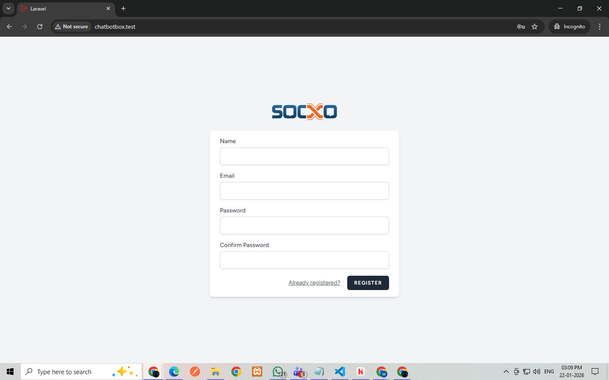
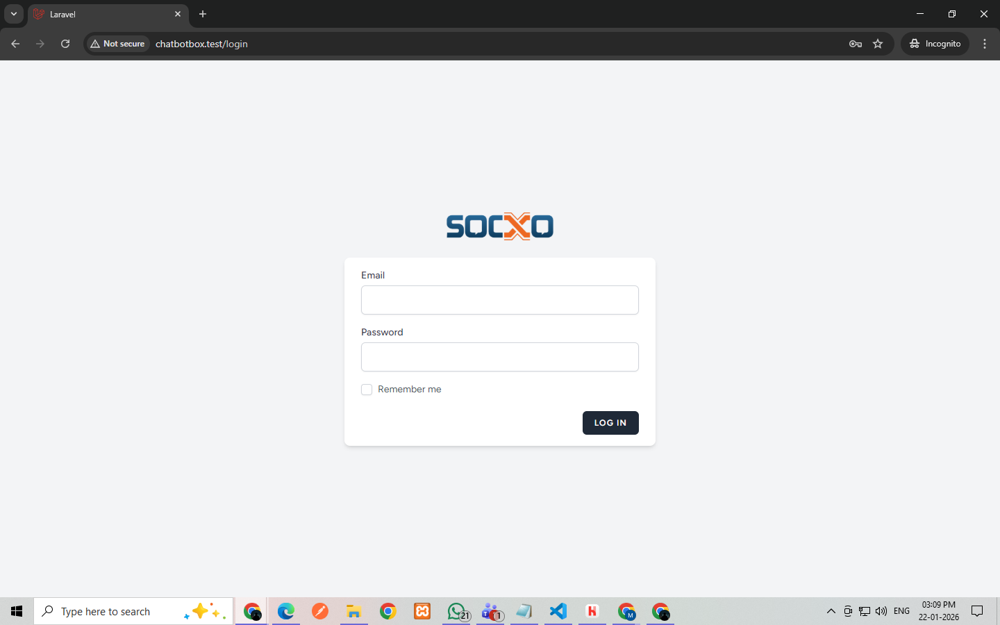
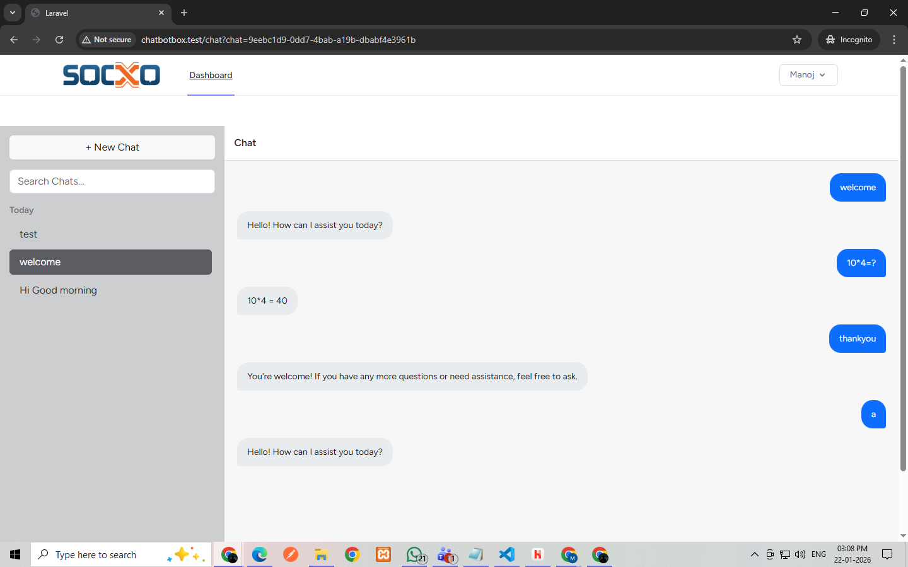
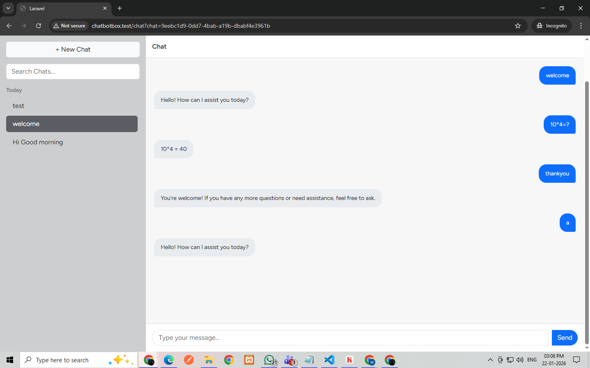

<p align="center"><a href="https://laravel.com" target="_blank"></a></p>


# Socxo AI Chatbot 

A ChatGPT-style AI chatbot built with Laravel, featuring:
- Multiple chat sessions
- Sidebar chat history
- New chat creation
- Token limit per chat (20,000)
- Clean UI similar to ChatGPT

---

##  Features
- User authentication
- Sidebar with previous chats
- Resume previous conversations
- New Chat button
- Token limit enforcement per chat
- OpenAI integration

---

##  Tech Stack
- Laravel 12
- PHP 8.2
- MySQL
- Bootstrap 5
- jQuery
- OpenAI API

---






##  Installation Steps

```bash
git clone https://github.com/Manojs-developer/Socxo.git
cd Socxo
composer install
cp .env.example .env
php artisan key:generate
php artisan migrate
php artisan serve

npm run dev

